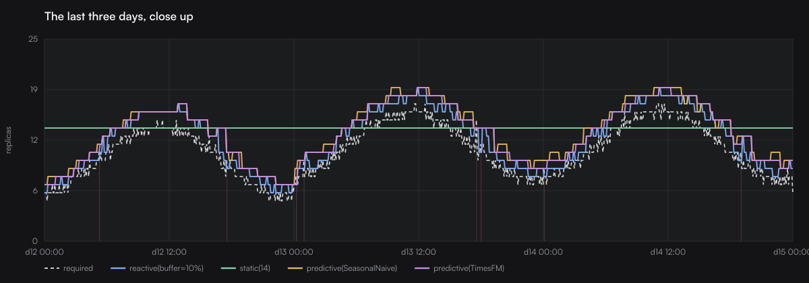

<p align="center">
  
</p>

<p align="center">
  <a href="https://github.com/breezycourses/presage/actions/workflows/ci.yaml"></a>
  <a href="https://artifacthub.io/packages/helm/presage/presage"></a>
  <a href="LICENSE"></a>
  = 1.27">
  
</p>

**Your autoscaler is always late.** It notices demand at 9:00 and starts a pod
that is ready at 9:02. For two minutes you are short, every single morning.

presage forecasts what demand will be *when the new pods are actually ready*,
and provisions for that instead. It uses
[TimesFM](https://github.com/google-research/timesfm), Google's open
time-series model, with **no training and no data leaving your cluster**.

It scales Deployments, StatefulSets, anything with a `scale` subresource — and
[Agones](https://agones.dev) Fleets.

---

## Does it actually work?

Here is presage against a conventional autoscaler on two weeks of simulated
game-server traffic. Dashed white is the capacity actually needed; the
coloured lines are what each strategy provisioned.

<p align="center">
  
</p>

Both track the shape. The difference is *timing* — and timing is the whole
game:

| | average replicas | short on |
| --- | ---: | ---: |
| conventional autoscaler | 11.5 | 1.5% of the time |
| **presage** (TimesFM) | 12.2 | **0.2% of the time** |

Spending the same money on a bigger buffer instead would leave you short 0.8%
of the time — four times worse than presage for the same cost.

> Numbers from [`make backtest-charts`](docs/backtesting.md), run against a
> reproducible synthetic signal. Run it on **your** metrics before believing
> any of it — that is exactly what the tool is for, and it will tell you if
> forecasting buys you nothing.

## Try it

```bash
helm install presage oci://ghcr.io/growlyx/charts/presage \
  --namespace presage-system --create-namespace
```

Then point it at something:

```yaml
apiVersion: scaling.presage.sh/v1alpha1
kind: PredictiveScaler
metadata:
  name: api
spec:
  mode: Shadow                    # watch it before you trust it
  scaleTargetRef: {apiVersion: apps/v1, kind: Deployment, name: api}
  signal:
    prometheus:
      address: http://prometheus-operated.monitoring:9090
      query: sum(rate(http_requests_total{app="api"}[5m]))
  leadTime: {source: Static, static: 90s}
  capacity: {perReplica: "250"}
  policy: {minReplicas: 2, maxReplicas: 50}
```

```bash
kubectl get predictivescalers
```

```
NAME   MODE     TARGET   CURRENT   RECOMMENDED   READY
api    Shadow   api      4         7             True
```

**Every scaler starts in `Shadow` mode**: it publishes what it *would* do and
changes nothing. Compare it against reality for a couple of weeks, then flip
to `Enforce`.

## Three things worth knowing

**It cannot starve your workload.** A conventional reactive calculation runs
alongside the forecast and sets a floor. A badly wrong forecast can only ever
give you *too many* replicas, never too few.

**Uncertainty buys capacity, not hesitation.** Capacity is sized to a high
quantile of the forecast, so when the model is unsure you get more headroom
rather than a paralysed autoscaler.

**A presage outage is a non-event for Agones.** presage never writes Fleet
replicas; it answers the FleetAutoscaler webhook and returns an error whenever
it cannot answer honestly, so Agones falls straight through to a plain buffer
policy.

## Documentation

| | |
| --- | --- |
| [Getting started](docs/getting-started.md) | install, shadow, evaluate, enforce |
| [How it decides](docs/policy.md) | forecast → replica count, and the safety properties |
| [Backtesting](docs/backtesting.md) | score it against your own history before adopting |
| [Agones](docs/agones.md) | Fleet autoscaling and the fallback that makes it safe |
| [Architecture](docs/architecture.md) | the pieces and why they are separate |
| [Operations](docs/operations.md) | metrics, alerts, "why did it pick that number" |
| [Comparison](docs/comparison.md) | versus HPA, KEDA, PredictKube, Agones Schedule |
| [API reference](docs/api-reference.md) | generated from the CRDs |
| [Examples](examples/) | Deployment, Agones Fleet, multi-signal |

## Status

**Alpha.** The API is `v1alpha1` and will change. What it does not do yet:

* No covariates — scheduled events and releases are not fed to the model, and
  that is where the biggest remaining gain is.
* Never run on a production cluster. It is exercised against a real API server
  and a real kind cluster in CI, but nobody's players depend on it yet.
* No KEDA or HPA adapter. The `scale` subresource covers most of that ground.

On a clean weekly curve, a plain seasonal baseline may match TimesFM — presage
ships that baseline in-process and the backtest will tell you which one wins on
your workload. Use the cheaper one if it ties.

## Contributing

Issues and pull requests welcome. See [CONTRIBUTING.md](CONTRIBUTING.md),
[SECURITY.md](SECURITY.md) for private vulnerability reporting, and
[GOVERNANCE.md](GOVERNANCE.md) for how the project is run.

## Licence

Apache-2.0. TimesFM is a separate Apache-2.0 project and is not vendored here;
the checkpoint is pulled at runtime from a pinned revision.
